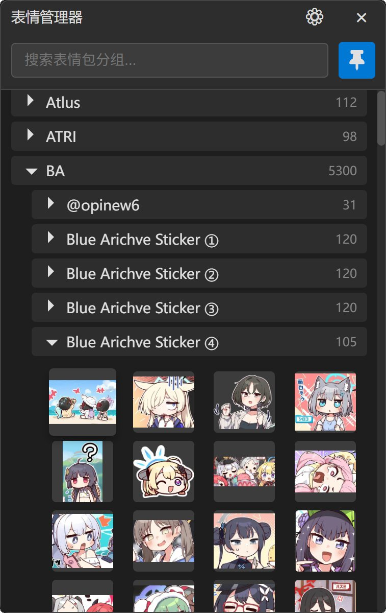

# EmojiManager - 表情包管理器

<div align="center">

  

*一个配合QQNT使用的本地表情包管理工具*  

[](LICENSE)
[](https://dotnet.microsoft.com/download/dotnet/8.0)
[](https://www.microsoft.com/windows)  

受够了QQNT的弱智表情管理？那么本工具也许就是你需要的！
</div>


## ✨ 功能特点

### 🚀 核心功能
- **快速访问**: 通过全局快捷键快速调出表情包选择器
- **一键复制**: 点击表情包即可复制到剪贴板（并在QQNT窗口自动粘贴）
- **最近表情**: 智能记录最近使用的表情，显示在列表顶部，支持自定义数量上限
- **实时监听**: 自动扫描并分类管理表情包文件夹，检测表情包文件夹变化，实时更新内容
- **文件夹结构**: 支持多层级文件夹组织，自动生成分类树
- **智能格式检测**: 自动检测图片文件的真实格式，解决QQNT导致的文件后缀混乱问题

### ⚙️ 个性化设置
- **自定义路径**: 可配置表情包根目录位置（默认在"我的图片/表情包"）
- **快捷键设置**: 支持任意组合键自定义（如 Ctrl+Alt+E）
- **最近表情管理**: 可设置记录数量上限（1-100个），0为关闭功能
- **状态记忆**: 自动记住窗口位置、大小和钉住状态
- **热重载**: 设置修改立即生效，无需重启
- **格式修正工具**: 一键修正现有文件的错误扩展名
- **排序选项**: 支持按创建时间或文件名排序图片

### 🎯 用户体验
- **现代界面**: 暗色主题，简洁美观
- **窗口钉住**: 可钉住窗口保持显示
- **智能隐藏**: 失去焦点时自动隐藏（钉住时除外）
- **拖拽支持**: 支持从QQNT聊天窗口拖拽图片到文件夹添加新表情，自动检测并修正文件格式
- **QQNT集成**: 针对QQ聊天窗口优化的自动粘贴功能
- **右键菜单**: 右键点击表情可打开目录或删除文件，操作更便捷

## 🛠️ 系统要求

- **操作系统**: Windows 10/11
- **运行时**: .NET 8.0 Runtime
- **浏览器内核**: Microsoft Edge WebView2（通常已内置）

## 📦 安装与使用

### 下载安装
1. 从 [Releases](https://github.com/Natsukage/EmojiManager/releases) 页面下载最新版本
2. 解压到任意目录
3. 运行 `EmojiManager.exe`

### 首次设置
1. **设置表情包路径**
   - 程序首次运行会使用默认路径：`我的图片/表情包`
   - 如需修改，点击标题栏的设置按钮（⚙）
   - 选择您的表情包存放目录
   - 程序会自动扫描所有子文件夹

2. **自定义快捷键**（可选）
   - 默认快捷键为 F12
   - 如需修改，在设置窗口点击"录制快捷键"
   - 按下您想要的组合键（如 Ctrl+Shift+E）
   - 程序会自动检测是否可用

3. **最近表情设置**（可选）
   - 默认记录最近20个表情
   - 可在设置中调整数量上限（0-100个）
   - 支持一键清空所有记录

### 基本使用
1. **打开表情选择器**: 按快捷键（默认F12）
2. **选择表情**: 浏览文件夹树，点击想要的表情
   - 最近使用的表情会显示在"最近使用"分组（默认展开）
   - 最近使用的表情会自动排在最前面
3. **自动粘贴**: 表情会自动复制到剪贴板，如果唤起程序之前的前台窗口是QQNT，将会自动粘贴到当前窗口

## ⌨️ 快捷键

| 快捷键 | 功能 |
|-------|------|
| F12（默认） | 显示/隐藏表情选择器 |
| 自定义组合键 | 可在设置中配置任意组合键 |

## 🎨 功能说明

### 表情包管理
- 自动扫描指定目录下的所有图片文件
- 支持 JPG、PNG、GIF、BMP、WebP 格式
- 按文件夹自动分类，支持多层级结构
- 实时监听文件变化，自动更新
- 支持从QQNT聊天窗口拖拽图片到窗口内添加新表情（需要开启钉住功能）
- 支持根据表情包名称进行搜索过滤

### 最近表情功能
- 智能记录最近使用的表情，按使用时间排序
- 显示在所有分组最顶部，默认展开
- 支持自定义记录数量上限（1-100个）
- 重复使用的表情会自动移到最前面

### 快捷键设置
- 实时录制快捷键组合
- 自动检测快捷键冲突
- 支持 Ctrl、Alt、Shift、Win 等修饰键
- 一键重置为默认设置（F12）

### 智能格式检测 🔍
- **真实格式识别**: 通过文件内容而非扩展名检测图片的真实格式
- **自动格式修正**: 拖拽文件时自动使用正确的扩展名保存
- **批量修正工具**: 一键修正现有表情包的错误扩展名
- **QQNT问题解决**: 完美解决QQNT导致的.null、.jpg标记GIF等问题
- **重复文件处理**: 智能检测和处理重名文件，避免数据丢失
- **支持多种格式**: JPG、PNG、GIF、BMP、WebP、TIFF、ICO等常见格式

### 智能交互
- 点击表情自动复制到剪贴板
- 针对QQNT优化的自动粘贴
- 失去焦点自动隐藏，不干扰正常工作
- 窗口钉住功能，方便连续使用
- 防误操作：不允许拖拽文件到"最近使用"分组

### 图片排序功能 📅
- **按时间排序**: 可选择按文件创建时间从最新到最老排序
- **按名称排序**: 传统的按文件名字母顺序排序（默认）

### 右键菜单功能 🖱️
- **打开目录**: 在资源管理器中定位文件，兼容Directory Opus等第三方文件管理器
- **删除文件**: 删除表情文件，包含确认对话框防止误操作

## 🏗️ 技术架构

- **框架**: WPF (.NET 8.0)
- **UI**: WebView2 + HTML/CSS/JavaScript
- **配置**: JSON 文件存储
- **文件监听**: FileSystemWatcher
- **全局热键**: Windows API

## 🔧 开发与构建

### 环境要求
- Visual Studio 2022 或 JetBrains Rider
- .NET 8.0 SDK
- Windows 10/11 开发环境

### 构建步骤
```bash
git clone https://github.com/Natsukage/EmojiManager.git
cd EmojiManager
dotnet restore
dotnet build
```

### 运行开发版本
```bash
dotnet run
```

## 📁 文件结构

```
EmojiManager/
├── MainWindow.xaml(.cs)      # 主窗口
├── SettingsWindow.xaml(.cs)  # 设置窗口
├── Settings.cs               # 配置管理
├── EmojiManager.html         # WebView2 内容
├── App.xaml(.cs)            # 应用程序入口
└── README.md                # 本文档
```

## ⚙️ 配置文件

设置文件位置：`%APPDATA%\EmojiManager\settings.json`

```json
{
  "emojiBasePath": "C:\\Users\\YourName\\Pictures\\表情包",
  "hotkeyModifiers": 0,
  "hotkeyVirtualKey": 123,
  "hotkeyDisplayName": "F12",
  "windowLeft": 1520,
  "windowTop": 420,
  "windowWidth": 400,
  "windowHeight": 600,
  "isPinned": false,
  "windowState": "Normal",
  "recentEmojisLimit": 20,
  "recentEmojis": []
}
```

## 🤝 贡献指南

欢迎提交 Issues 和 Pull Requests！

1. Fork 本仓库
2. 创建您的特性分支 (`git checkout -b feature/AmazingFeature`)
3. 提交您的修改 (`git commit -m 'Add some AmazingFeature'`)
4. 推送到分支 (`git push origin feature/AmazingFeature`)
5. 打开一个 Pull Request

## 📝 版本历史

- **v1.1.2** - 图片排序功能更新
  - 📅 新增按创建时间排序选项，支持从最新到最老排列
  - ⚙️ 设置界面新增图片排序配置项
  - 🔄 排序设置实时生效，无需重启程序

- **v1.1.1** - 右键菜单功能更新
  - 🖱️ 新增表情右键菜单功能
  - 📁 支持"打开目录"定位文件，兼容第三方文件管理器
  - 🗑️ 支持"删除"图片，包含操作确认

- **v1.1.0** - 智能格式检测更新
  - 🔍 新增智能图像格式检测功能
  - 🛠️ 解决QQNT文件后缀混乱问题
  - 📁 支持检测.null、无扩展名等异常文件
  - ⚙️ 新增批量格式修正工具
  - 🎯 优化拖拽文件处理逻辑
  - 📊 增强文件监听和扫描功能

- **v1.0.0** - 初始版本发布
  - 基础表情包管理功能
  - 全局快捷键支持
  - 最近表情功能
  - 可配置设置界面

## 📄 许可证

本项目采用 MIT 许可证 - 查看 [LICENSE](LICENSE) 文件了解详情

## 🙏 致谢

- [Microsoft WebView2](https://developer.microsoft.com/microsoft-edge/webview2/) - 现代Web技术集成
- [.NET Community](https://dotnet.microsoft.com/) - 强大的开发框架